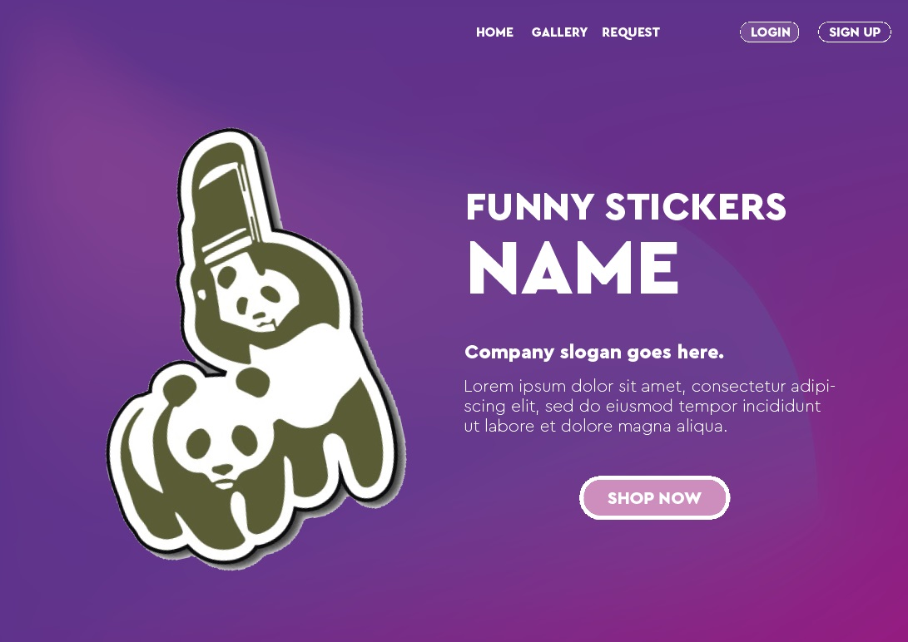
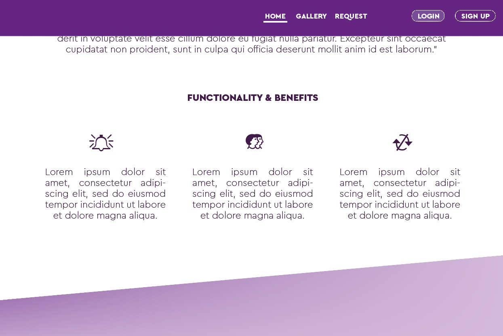
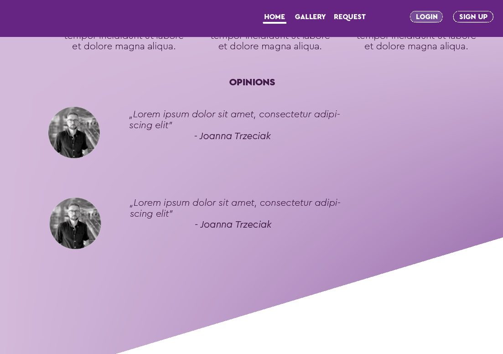
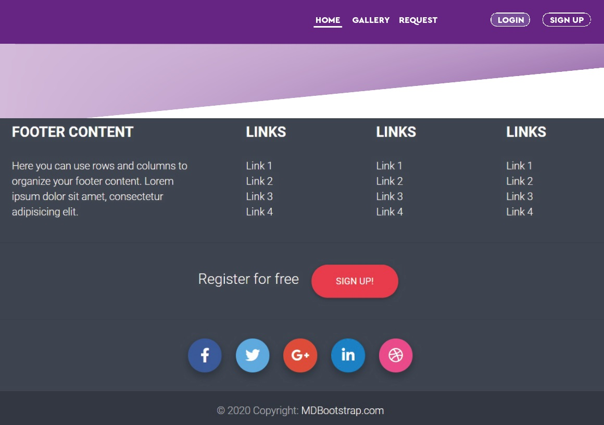
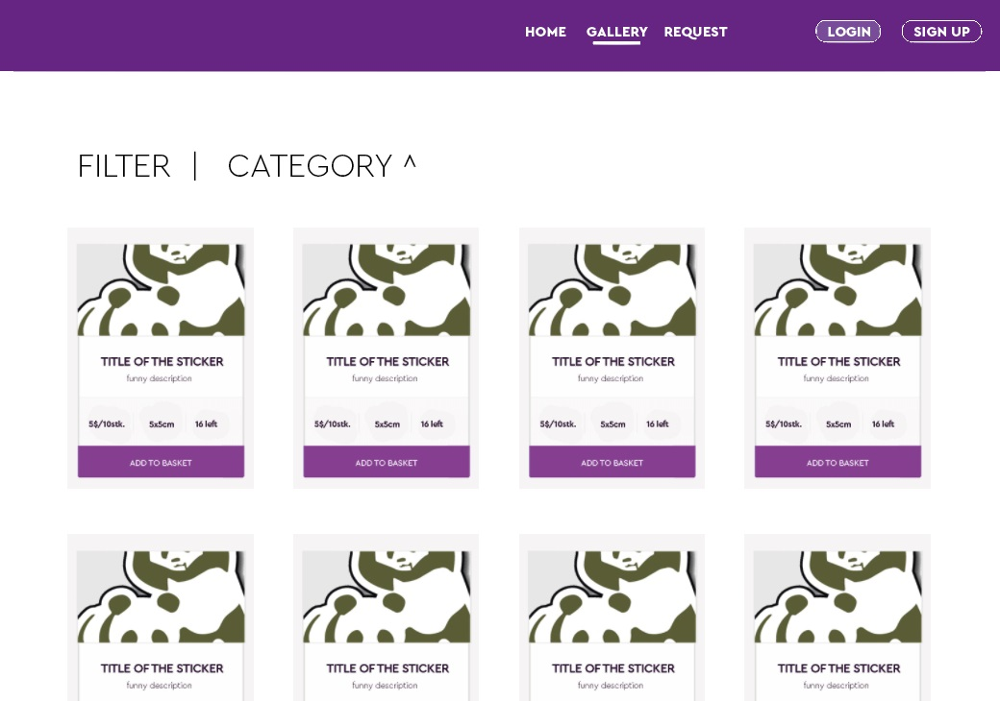
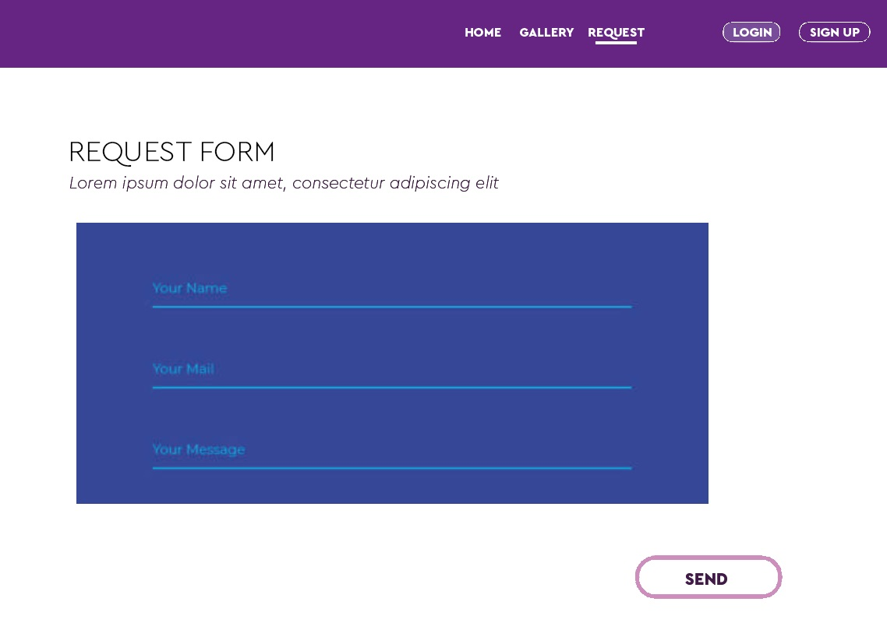

# PJ - Stickers
...........................................................................................
PJ - Stickers in an e-commerce website selling eco - friendly stickers. 
It provides sets of ready stickers to purchase as well as form to request a custom design.

Products are eco-friendly, inspiring fun and smart stickers! High quality print, free delivery in Amsterdam area and more. 

User can register to Partal, creating profile. 

# UX Write up
...........................................................................................
## color scheme
- Main body uses generated css gradient (via https://www.ccbg.io/)
PURPLE, PINK, NAVY
There colors are meant to create positive, fun, and modern look (a reminder of other visual apps like instagram) 

- Main buttons and call to action buttons:
Used as a contrast to purple background. Eye - catcher. 
ORANGE rgb(255, 166, 0);

## typography
- Main titles and titles on the product cards:
font-family: 'Sriracha'
- Rest:
font-family: 'Ubuntu'

## USER STORIES
### Epic:
As a user, I want to purchase eco-friendly stickers 
### Detailed:
As a private person (resident of Amsterdam), I want to purchase already created eco stickers so that I can use them as an inspiration at my party/ wrap my gifts/ promote my ideas and be sure that I am helping the environment. 
Ensure enough inspirational stickers for any occasion
- Promote sustainability on each sticker
- Create a promo code for first purchase
- Create company/ private user field within account setup 
- Promote free delivery within Amsterdam borders

As a new business owner, I want to purchase custom made eco stickers so that I can promote my company/ run the campaign and use sustainability as a promotional factor creating a positive image of the newly created brand. 
- Create friendly request form 
- Promote sustainability on each sticker

As a company, I want to purchase a design of eco stickers so that I can advertise in the fairs/ increase my audience via branding/ have it for internal use and in any case promote sustainability which aligns with the vision of my company. 
- Create company/ private user field within account setup 
- Promote sustainability on each sticker
- Create discounts on larger purchases 

## WIREFRAMES
An early stage draft of the app. Changes appied. 

### Home page top

### Home page about

### Home page benefits

### Home page quotes

### Footer

### Gallery

### Request Form

# FEATURES
...........................................................................................
### Navbar 
Navbar is responsive and in mobile version is isplayed as toggle drop down menu. Light transparency provides extra styling and keeps elements visable at all times. 
(elements of the navbar are repeated in the footer element as well as on the home page for better user experience)
- Logo at the top left corner (self designed)
-a link to home page
- Shop btn
-a link to shop page
- Request btn
-a link to request page
- Register btn
-a link to shop page
- Login btn
-a link to login page
- shopping cart btn
-a link to shoping cart page (featured in extra badge which (if any) displays the amount of items in the basket). Works as a purchase preview as well as payment link. 

### Homepage 
- Teaser Page. Iconic zebra sticker (featured multiple times) on the left and teaser text with call to action button on the right. 
- Usability explained with additional call to actions buttons as a repetition and explanation of navbar features. 
- Selling points. 3 icons representing best selling points of the e-commerce webpage. 
- Quotes. The reviews from previous users and star representing points. User can leave the review under the profile tab. 

### Shop 
- All the products listed in the set of card display.
- Shop page is featured with the search button which allow user to search among products using key words. 
- Each card in the deck features: image of the sticker, title, short description, price and add to the card functionality. After typing the number (max 999) in the input form user will be notyfied of existing items in the cart with orange notyfication badge in the top right corner

### Request 
- A form allowing user to request a custom made sticker. Form is sent to the Website owner by Email JS.
- Request button at the bottom of the page (ORANGE color used as call to action). 
* All the form's fields are required (exept of promo code). Form validation has been used. 

### Register / Profile
- If user is already logged in "REGISTER" option will not appear in the navbar. 
Registration works as creating new account. 
After registering as a  new user, customer will recive an alert with the promo code. 
To finish registration successfully user has to fill in the username form, email address, password and password confirmation. 
- Profile page (displayed only when user is logged in) has a welcome message from the owner of the page. Here User can see "Welcome ${user name} message customized with his/her own name. Under the profile user can send a review. 
- in the future user will be able to see also purchase history here. 
- Register button at the bottom (ORANGE color used as call to action)
* All the form's fields are required (exept of promo code). Form validation has been used. 

### Log in / Log out 
Here user can log in using username or email and password. 
Under the log in form user can see "Forgot my password" link. This functionality will allow user to send reset password for to his/ her email address. 
When user is already legged in then here he/she will see the log out button. 
* All the form's fields are required (exept of promo code). Form validation has been used. 
- Log in button at the button (ORANGE color used as call to action)

### Cart
- User has to be logged in to perform transaction.
- If the shopping cart is empty then "Check out" button will change to "Cart is Empty". 
- User can preview items previously added to the cart.
- Total cost of the transaction is displayed in the frame below. 
- User can edit the amount and confirm the change by clicking "Amend" button. 
- Iconic zebra sticker at the button. 

#### Check out 
- Again, user can preview items previously added to the cart.
- Total cost of the transaction is displayed in the frame on top. 
- payment details. 
- Submit payment button (ORANGE color used as call to action) at the button.
- Payment page constructed and tested via Stripe payments technology. 

### Footer
- Logo in different color scheme featured (clickable - leads to home page)
- Short description of the service. 
- QUICK LINKS. Minimalistic repetition of the navbar buttons. 
- GET STARTED. Quick reminder about possibility of getting discount thanks to regirtration option. 
- CONTACT. email provided as well as social media links. 
- COPYRIGHT stripe

### In the future:
- user purchase history
- more content

# TESTING Write up
...........................................................................................
### Forms
- all the form have validation features. all forms passed testing. 
! card with products should accept only numbers. However, they do accept letter 'e'. This error has to be fixed later. 
### Buttons
- all the buttons are linked correctly and fire up successfully 
### Payment 
- test payment with stripe technology was performed successfully 
### Email 
- email sent via REVIEW form as well as REQUEST form
- emails were received in correct form and without errors
### Travis 
- Travis used for automatic validation on deployed site
### Responsivenes
- site terted in google chrome developer tools as well as on desktop and mobile versions. All elements are responsive, the layout does not breat, elements are not overlaping. 
### Code validation
- Python Code tested with PEP8. Python code adheres to PEP8 standards. (http://pep8online.com/checkresult)
    exception being E501 "line is too long"
- HTML code tested with online validator. (https://www.freeformatter.com/html-validator.html)
- CSS code tested with online validator (http://csslint.net/)
    exception being "Using width with padding can sometimes make elements larger than you expect."

# DEPLOYMENT Write up
...........................................................................................
My project was developed using GitPod IDE, committed to git and pushed to GitHub. Finally the code was wired up with AWS S3 where dynamic media content of shop products are stored. The following steps where taken to deploy my project.
### From GitHub
- Logged into GitHub.
- Selected repository from the GitHub dashboard.
- Clicked on "Open in GitPod button"
- From gitpod I accessed the page via terminal coment "python3 manage.py runserver"
### From Heroku
- Logged into Heroku
- Opened the pj-stickers project 
- In Deploy panel I clicked Deploy branch
- After the page is deployed I opened the app vie "Open App" button

Website is now deployed and is available here:
https://pj-stickers.herokuapp.com/
My repository can be found here:
https://github.com/pjachimowski/stickers

## AWS s3
- Media stored in AWS S3 bucket 
- Static files and CSS sored in the project on Heroku

# TECHNOLOGIES USED
...........................................................................................
### Languages
- HTML
- CSS
- JavaScript
- Python
- django
- Stripe payments

### Libraries
- Bootstrap (https://getbootstrap.com/)
- Fontawesome (https://fontawesome.com/)

### Database
- AWS s3
- local sqlite

### Others
- gradient generator CSS (www.ccbg.io)
- Email JS (https://www.emailjs.com/)
- Heroku cloud platform

# Use of other code
...........................................................................................
- footer source(edited)  https://colorlib.com/wp/bootstrap-footer/

- I use fragments of the code from previous lessons of Code Institure.
All codes were sourced from my own profile on GitHub portal
Parts of the code were edited and adjust to page layout.

### Media
Some stickers were downloaded for free picture collection https://www.pexels.com/
Icons were taken from font awesome portal.
Entire text was edited by author.

# TESTING Write up
...........................................................................................
## HTML
- HTML code produces NO errors on being passed through a validator.
https://validator.w3.org/nu/ 

- All the forms passed testing. All the forms featured with form validation code. 

## Password reset
- Password reset tested and passed successfuly. It may display following error:
SMTPAuthenticationError at /accounts/password-reset/
Due to google account default setups. 
Last time updated: 01.05.2020 after which averything was working correctly. 

### Acknowledgments

- I received inspiration for this project from various lessons conducted at Code Institute
